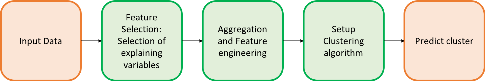
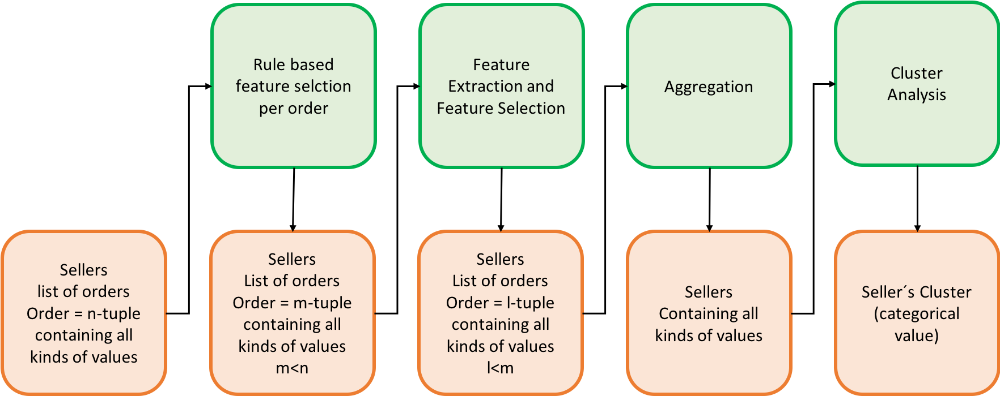

# Developing seller persona for online-retail

Within this project seller personas for online-marketplace giant Olist will be developed. Based on prototypical attributes, the online-sellers are categorized into different peer groups. By knowing a seller’s category, their respective major characteristics can be inferred. The obtained insights help Olist to manage marketing measures more precisely and minimize coverage loss.

Independ from a specific business sector, it is important for a company to know its business partners. Extensive insights are necessary to derive strategic decisions and maintain long-term profitability. To categorize consumers or sellers, based on key behavioral patterns, so-called personas are used in Marketing. Within this approach, similarities and differences amongst a company's stakeholders are detected. On this basis, specific, homogeneous target groups and the corresponding companies can be identified. These can be used for further analysis and a data-driven decision-making.\

## Workflow in this project
To structurize the workflow of placing the sellers to specific classes, three Directed Acyclic Graphs (DAGs) are developed.\
 

The first DAG describes the general workflow. 
It contains not only what the output should be, but on a high-level view also how to transform the input data to get there.\
 
\

 
From this basis, a second DAG is derived that describes mainly the technical process of mapping the spaces togheter. 
It is key in this step to describe the space changes after each processing step, to keep track in which space one is currently workin in.\
 
 
\
 
The third DAG takes the information of the two previous Graphs and defines which work the developer has to perform to get there. 
The steps range from elementary things such as feature selection and feature engineering, up to quantitatively defining and describing the final clusters.\
 

